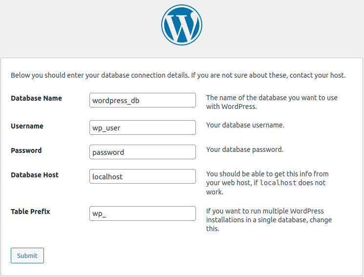
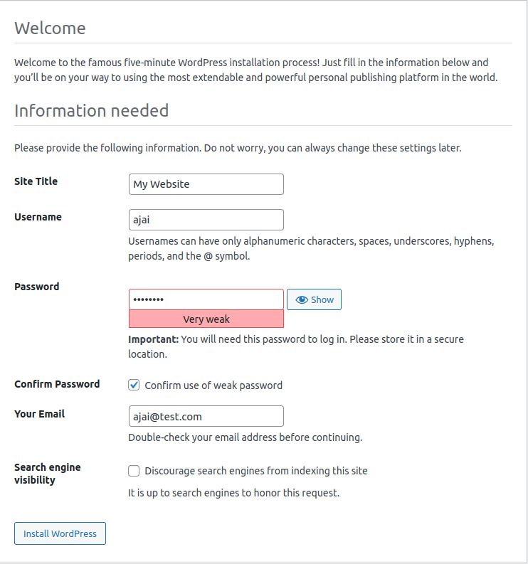
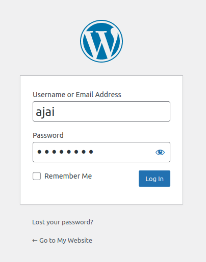

# Wordpress Setup for Noobs

WordPress is a free and open-source content management system written in hypertext preprocessor language and paired with a MySQL or MariaDB database with supported HTTPS. Features include a plugin architecture and a template system, referred to within WordPress as "Themes". - Wikipedia

__What you need ?__
- Ubuntu Server
- Internet Connection

__Objectives__
- [Install LAMP (Linux, Apache, MySQL, PHP)](#install-lamp)
- [Setup Wordpress Database](#setup-wordpress-database)
- [Install Wordpress](#install-wordpress)
- [Setup Wordpress](#setup-wordpress)

***

## Install LAMP

1. Update and upgrade your system
```sh
apt update && apt upgrade
```

2. Install Apache
```sh
apt install apache2
```

3. Install and setup MySQL
```sh
apt install mysql-server
```

Change root password
```sh
sudo mysql
```
```sql
ALTER USER 'root'@'localhost' IDENTIFIED WITH mysql_native_password BY 'password'; 
exit 
```
```sh
mysql_secure_installation
```

4. Install PHP component
```sh
apt install php libapache2-mod-php php-mysql
```


## Setup Wordpress database

Login into mysql and create Wordpress database
```sh
mysql -u root -p 
```
```sql
CREATE DATABASE wordpress_db; 
CREATE USER 'wp_user'@'localhost' IDENTIFIED BY 'password'; 
GRANT ALL ON wordpress_db.* TO 'wp_user'@'localhost'; 
FLUSH PRIVILEGES; 
SHOW DATABASES;
exit;
```

## Install Wordpress

1. Change to /var/www/html and download Worpress package
```sh
cd /var/www/html/ 
wget https://wordpress.org/latest.tar.gz 
tar -xvf latest.tar.gz 
rm latest.tar.gz
```

2. Make uploads directory and change permission of Worpress directory
```sh
mkdir /var/www/html/wordpress/wp-content/uploads 
chown -R www-data:www-data /var/www/html/wordpress/ 
chmod -R 755 /var/www/html/wordpress/
```

## Setup Wordpress

1. Access Wordpress using your ip address
```
http://127.0.0.1/wordpress
```

2. Fill in the database and username that we create earlier



3. Setup the Wordpress credentials



4. Now you can login to your Wordpress



# Congratulations, you successfully install your Wordpress
